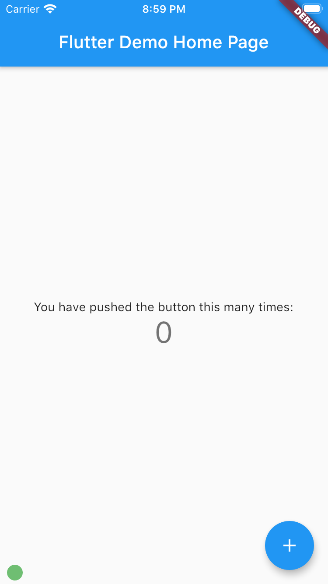
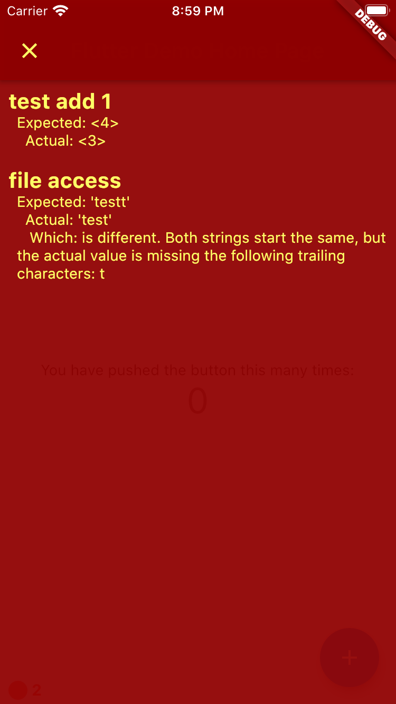
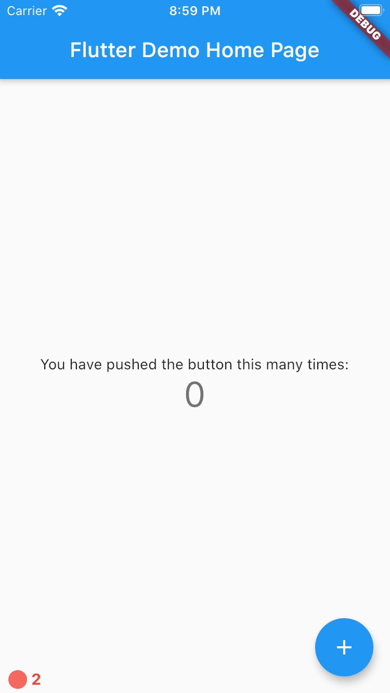

# hottie

Experiment to run tests inside a running app, for faster feedback loop. 

## Why?

Usually, flutter tests are executed by "flutter test" command or IDE equivalent. Unfortunately, this method is pretty slow (around 5s of startup before anything executes) and does not support hot reload. Additionaly, you have to manually rerun those tests on each change, which takes your focus from actual code.

Instead of using flutter test to run tests, hottie allows you to embed them (with some hacks) directly into the running app. This way, you get hot reload support and instant feedback. Combined with automatic hot reload from your IDE, this gives you a very smooth TDD experience. Hottie does not affect production apps - you access it with separate main file which ensures that no test code will be actually embedded in your release builds.

## UI

<table>
 	<tr>
  	<td>If all is good, hottie will display a green circle in bottom left corner.</td>
   	<td>As soon as your code gets broken, you will see a red screen with details.</td>
		<td>You can always close it. Red circle will indicate how many tests failed.</td>
 	</tr>
 	<tr>
  	<td></td>
   	<td></td>
		<td></td>
 	</tr>
</table>
				
## Running the example

1. Run example/test/main_hottie.dart (VSCode config is already added, AS users are on their own).
2. Notice green indicator in the bottom left corner.
3. Break some tests or tested methods. Save and hot reload.
4. See error page appearing with failed test.
5. Fix tests.
6. See that error page disappeared.

## Adding to existing project

1. Add hottie to your dev_dependencies:
```yaml
dev_dependencies:
  flutter_test:
    sdk: flutter
  hottie:
    git: https://github.com/szotp/hottie
```

3. Create this main_hottie.dart file in your test directory, and [configure your IDE to use it](https://stackoverflow.com/questions/55510244/flutter-how-do-i-change-main-dartentry-point-to-some-other-page-in-flutter).
```dart
import 'package:flutter/widgets.dart';
import 'package:flutter_test/flutter_test.dart';
import 'package:hottie/hottie.dart';
import 'package:example/main.dart' as m;


Future<void> main() async {
  runApp(
    TestRunner(main: testAll, child: m.MyApp()),
  );
}

@pragma('vm:entry-point')
void hottie() => hottieInner();

void testAll() {}
```

4. Import all your test files and run them in testAll method:
```dart
import 'package:flutter/widgets.dart';
import 'package:hottie/hottie.dart';
import 'package:example/main.dart' as m;

import 'standard_test.dart' as t1;
import 'widgets_test.dart' as t2;

void main() {
  runApp(
    TestRunner(main: testAll, child: m.MyApp()),
  );
}

void testAll() {
  t1.main();
  t2.main();
}
```
5. Run your app and enjoy rapid testing.

## More examples
Provider fork with hottie: https://github.com/szotp/provider/tree/hottie
On my machine, all 274 tests execute in around 1 second.

## Supported platforms
* macOS
* iOS simulator
* Android (without file access)

## Known issues
1. Tests from packages can't be accessed from app project, unless they have been moved into lib directory (which is not great because code completion for flutter_test items does not work).
2. Hottie doesn't fully support running on device because test resources will not be bundled with the app.

## Future ideas:
1. Instead of embedding hottie into the app, it may be possible to create console flutter app that would import the tests and run them.
2. Better formatting for errors.
3. Add ability to disable tests from UI.
4. Benchmark tests and disable the heavy ones automatically.
5. Customizable delay from hot reload to test execution.

## File access
File access on Android is currently not possible. Ideas how to implement this are welcome.

To setup file access for your test, in iOS and macOS, call `HottiePlugin.instance.setRoot()` where plugin registration happens (check the example project for more details).  Additionally, for macOS, you will also need to disable sandboxing, or add an exception for the test directory.

To omit tests that use filesystem, add "File" tag to them, or simply do not call them in your testAllMethod.
